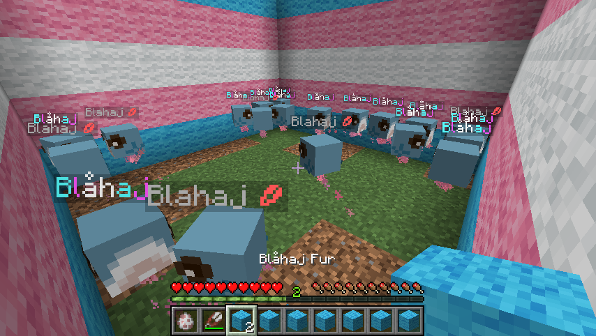

# Hello World
Currently adds cute Blåhaj.  Blåhaj has a small chance of spawning where sheep normally would & can also be sheared for their fur which, has limited use as of now.

If you wish to spawn Blåhaj yourself, execute `/getBlahajEgg`.

# Instructions to use
Install a version 1.20.2 Minecraft server (other versions of MC might work).  I downloaded my server from [minecraftversions.net](https://www.minecraftversions.net/paper) though you can also use the Paper's [downloads API](https://docs.papermc.io/misc/downloads-api)

You may use the instructions @ [PaperMC.io](https://docs.papermc.io/paper/getting-started) to help you install the server correctly.

Once the server is set up, place [Skript](https://github.com/SkriptLang/Skript/releases) & [SkBee](https://github.com/ShaneBeee/SkBee/releases) inside the `*/plugins` folder.  Skript will create a new `*/scripts` folder, and place any `*.sk` files from this repo into that folder.  They will need to be reloaded with either a server restart or having an admin run `/sk reload all` (or reloading the files individually) :3

# Version Info
Developed Using:
- 1.20.2 [Minecraft Paper Server](https://api.papermc.io/v2/projects/paper/versions/1.20.2/builds/318/downloads/paper-1.20.2-318.jar) (Paper API download)
- 2.9.5 [Skript](https://github.com/SkriptLang/Skript/releases/download/2.9.5/Skript-2.9.5.jar) (GitHub download)
- 3.6.1 [SkBee](https://github.com/ShaneBeee/SkBee/releases/download/3.6.1/SkBee-3.6.1.jar) (GitHub download)